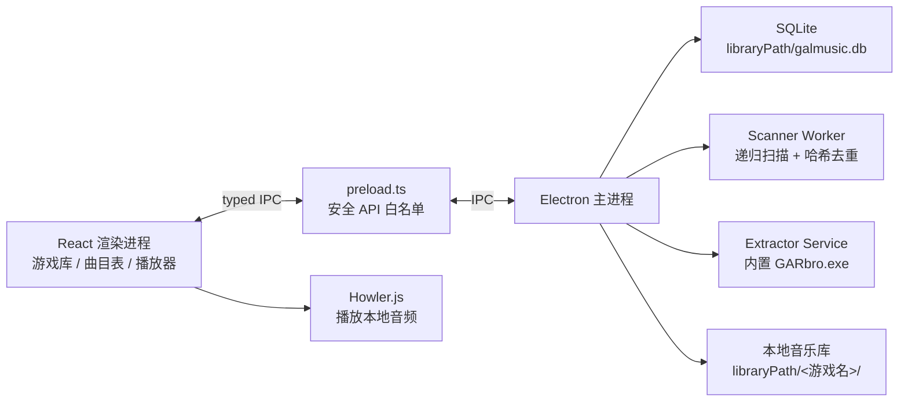

# GalMusic 桌面应用设计规格

**日期**：2026-07-27  
**状态**：已确认，进入实现计划阶段  
**项目目录**：`galgame-music-app/`  
**依据**：`findings.md`、`task_plan.md`、`GalMusic-设计文档.md` 与本轮确认结果

## 1. 目标与范围

GalMusic 是一款只面向 Windows 10/11 的离线桌面应用，解决用户删除 galgame 本体后仍想保留并收听配乐的问题。应用需要把“从游戏目录提取音频”“持久化音乐库”“按游戏管理曲目”和“本地播放器”整合到同一条工作流中。

本轮确认的首要交付是可运行的 Electron + React + TypeScript 功能骨架，而不是静态设计稿。骨架必须包含真实的本地文件扫描、SQLite 持久化、IPC 边界、Howler 播放接口，以及内置 GARbro 的归档解包接入点。

### 1.1 已确认的决策

- 架构：分层 Electron。主进程负责文件、数据库、解包和 IPC；渲染进程负责 React UI 和 Howler 播放。
- 归档：应用内置并自动调用 GARbro；`.rpa` 优先走内置 Node 解包器，失败时回退 GARbro。
- 视觉：C「雨后磁带」——蓝绿夜色、薄荷高亮、低频樱粉点缀。
- 数据：导入后复制到独立音乐库，源游戏删除不影响已导入音乐。
- 网络：纯本地运行，不依赖 VGMdb 或任何在线服务。

### 1.2 主要成功标准

1. 用户选择一个 galgame 文件夹后，可以导入普通音频并立即播放。
2. 开启深度扫描后，可以通过内置 GARbro 发现归档中的音频。
3. 重复导入不会创建相同文件的重复曲目。
4. 删除源游戏文件夹后，音乐库中的复制文件仍然可播放。
5. 重启应用后，游戏、曲目、设置和播放器偏好仍然存在。
6. 无网络环境下可完成上述流程。

## 2. 系统架构



### 2.1 主进程边界

- `electron/main.ts`：创建窗口、注册生命周期和 IPC。
- `electron/preload.ts`：通过 `contextBridge` 只暴露显式白名单 API。
- `electron/services/scanner.ts`：递归发现音频、读取元数据、计算哈希、发出进度。
- `electron/services/extractor.ts`：调用 `resources/tools/garbro/GARbro.exe`，管理临时目录和子进程。
- `electron/services/library.ts`：封装 games、tracks、playlists、settings 的 SQLite CRUD。
- `electron/services/settings.ts`：读取和写入库路径、音量、窗口尺寸和最后选中项。
- `electron/database/`：连接、迁移和参数化查询。
- 扫描与解包使用 worker/子进程，避免阻塞窗口；所有子进程退出时统一清理。

### 2.2 渲染进程边界

- React 组件只通过 `window.galMusic` 调用主进程能力，不直接访问 `fs`、`path` 或 SQLite。
- Zustand 分为 `libraryStore`、`playerStore`、`uiStore`，分别管理库数据、播放状态和界面状态。
- Howler.js 只负责音频播放；音频路径由主进程验证后转换成安全的 `file://` URL。
- 视觉层包含自绘标题栏、深色渐变/噪点背景和低频装饰动画；`prefers-reduced-motion` 时禁用动画。

### 2.3 Electron 安全基线

窗口固定使用：`contextIsolation: true`、`nodeIntegration: false`、`sandbox: true`、`frame: false`、`windowsHide: true`。所有路径通过 `path.normalize()` 处理，并限制在用户选择的源目录、临时目录和音乐库目录内。GARbro 参数以数组传给 `spawn`，不拼接未经验证的 shell 命令。

## 3. UI / UX 设计

### 3.1 视觉语言

| Token | 值 | 用途 |
|---|---|---|
| `--bg` | `#0E171E` | 主背景 |
| `--surface` | `#14232B` | 侧栏、播放器 |
| `--surface-2` | `#1B3039` | 卡片、输入框 |
| `--mint` | `#7DE2D1` | 主按钮、播放进度、选中态 |
| `--mint-deep` | `#3EA59B` | hover、次级强调 |
| `--sakura` | `#F6A4C0` | 少量状态点、装饰、错误旁的柔和提示 |
| `--text` | `#E8F3F4` | 主文字 |
| `--muted` | `#90A8AD` | 次文字、元数据 |

背景使用径向渐变和轻微噪点，不使用大面积紫色渐变。樱花/磁带颗粒控制在 8–12 个，作为深色界面的呼吸感，而不是主视觉负担。

### 3.2 主窗口

- 顶部 44px 自绘标题栏：菜单、GalMusic 标识、全局搜索和窗口控制。
- 左侧 240px 导航栏：全部音乐、最近添加、收藏、播放列表，以及按游戏分组的封面列表；底部固定“+ 导入游戏音乐”。
- 中央内容区：当前游戏标题、曲目统计、曲目表格。曲目支持名称/格式/时长排序，双击播放，右键重命名、打开所在目录、从库中删除。
- 底部 92px 播放器：封面与曲名、上一首/播放/下一首、进度条、播放模式、音量。

### 3.3 状态与交互

- **空库**：插画、简短说明和“导入游戏音乐”主按钮。
- **有库未选中游戏**：显示游戏数、曲目数、最近添加。
- **选中游戏**：显示封面、游戏名、曲目数和完整曲目表。
- **扫描中**：模态对话框按“扫描 → 解包 → 复制”显示阶段和当前文件，可取消。
- **扫描完成**：显示发现、解包、导入、跳过、失败数量，并提供“查看曲目”。
- **播放失败**：保留当前曲目，给出可读错误和“重新定位文件”入口。

### 3.4 扫描对话框

1. 选择源文件夹。
2. 自动推断并允许编辑游戏名。
3. 默认开启“深度扫描（解包归档）”。
4. 显示阶段进度、总数、当前文件和取消按钮。
5. 显示结果摘要和失败列表。

## 4. 数据模型与文件组织

默认库路径为 `%USERPROFILE%/Music/GalMusic/`，首次启动允许用户更改。

```text
<libraryPath>/
├─ <游戏名>/
│  ├─ 音频文件
│  └─ cover.png/jpg（可选）
└─ galmusic.db
```

### 4.1 表结构

- `games(id, name, cover_path, created_at, updated_at)`
- `tracks(id, game_id, file_path, file_name, custom_name, duration, format, file_size, file_hash, track_number, created_at, updated_at)`
- `playlists(id, name, created_at)`
- `playlist_tracks(playlist_id, track_id, position)`
- `settings(key, value)`

`tracks.game_id` 外键级联删除；`game_id`、`file_hash`、`custom_name` 建索引。数据库使用参数化查询和迁移版本号。

### 4.2 导入与去重

1. 递归扫描普通目录中的 `.ogg/.mp3/.wav/.flac/.m4a/.aac/.opus`。
2. 发现 `.xp3/.arc/.pak` 时调用内置 GARbro；`.rpa` 优先走 Node 解包器。
3. 归档解到临时目录后，和普通文件走同一套筛选逻辑。
4. 先用文件大小 + 前 4096 字节快速筛选，疑似重复时计算完整 MD5。
5. 相同哈希跳过；同名不同内容自动生成不冲突目标名。
6. 采用流式复制，成功后写入数据库；任务结束清理临时目录。

单项失败不回滚其他成功项；结果页列出失败文件和原因，支持重试。

## 5. IPC 合约

### 5.1 请求

`scan:start`、`scan:cancel`、`library:get-games`、`library:get-tracks`、`library:add-tracks`、`library:update-track`、`library:delete-track`、`library:search`、`dialog:select-folder`、`dialog:select-files`、`dialog:select-image`、`shell:open-explorer`、`app:get-settings`、`app:set-setting`

### 5.2 推送事件

`scan:progress`、`player:state-change`、`player:time-update`、`player:error`

### 5.3 类型约束

```ts
type PlayMode = 'sequential' | 'random' | 'single-loop' | 'list-loop';

interface Game {
  id: string;
  name: string;
  coverPath: string | null;
  trackCount: number;
  createdAt: string;
  updatedAt: string;
}

interface Track {
  id: string;
  gameId: string;
  filePath: string;
  fileName: string;
  customName: string | null;
  displayName: string;
  duration: number | null;
  format: string;
  fileSize: number;
  fileHash: string;
  trackNumber: number;
  createdAt: string;
  updatedAt: string;
}

interface ScanProgress {
  phase: 'scanning' | 'extracting' | 'copying';
  current: number;
  total: number;
  currentFile: string;
}
```

## 6. 播放器行为

- 使用 Howler.js，设置 `html5: true`，每次切歌卸载旧 Howl。
- 支持播放/暂停、上一首、下一首、可拖拽进度、音量、顺序播放、随机播放、单曲循环、列表循环。
- 双击曲目立即播放；播放结束按 `PlayMode` 决定下一步。
- 音频文件缺失时不删除数据库记录，播放器显示“文件缺失”，允许重新定位。
- 退出时保存音量、播放模式和最后曲目；重启后恢复界面状态，不自动播放。

## 7. 错误处理、日志与取消

统一错误码：`FILE_NOT_FOUND`、`PERMISSION_DENIED`、`EXTRACT_FAILED`、`UNSUPPORTED_FORMAT`、`DB_ERROR`、`DUPLICATE_TRACK`、`PLAYBACK_ERROR`、`CANCELLED`。

- 用户可解决的问题显示友好中文提示和下一步动作。
- 解包失败保留源归档，不删除用户文件。
- SQLite 批量写入使用事务；单条错误不会破坏已成功导入的数据。
- 取消扫描会停止 worker、终止 GARbro 子进程、清理临时目录并保留已导入结果。
- 主进程日志写入 `%APPDATA%/GalMusic/logs/`，渲染进程错误只通过 IPC 传递用户可读信息。

## 8. 验证策略与验收

### 8.1 自动化验证

- 单元：路径规范化、扩展名识别、哈希去重、游戏名推断、播放模式、数据库 CRUD。
- 服务：临时目录扫描、流式复制、取消任务、重复导入、假的 GARbro CLI 成功/失败分支。
- IPC：preload 白名单、参数校验、错误序列化。
- UI：空库、扫描中、扫描完成、无曲目、文件缺失和播放失败状态。

### 8.2 Windows 手工验收

- Windows 10/11 安装和卸载。
- 中文路径、空格路径和较长路径。
- `.ogg/.mp3/.wav/.flac` 普通文件导入。
- `.xp3/.rpa/.arc/.pak` 深度扫描和 GARbro 失败提示。
- 大于 50MB 的音频文件。
- 删除源游戏目录后继续播放库内副本。
- 断网运行、重启恢复、日志可读。

## 9. 非目标与后续扩展

本轮不接入在线元数据、云同步、跨平台支持和复杂的播放列表编辑器。播放列表、系统托盘、媒体键、封面编辑和波形缓存保留清晰接口，待核心导入/播放流程稳定后再实现。

## 10. 推荐实现顺序

1. 初始化 Electron + React + Vite + TypeScript 工程和安全窗口。
2. 建立 SQLite 连接、迁移、类型和基础库查询。
3. 完成主窗口布局、空状态、游戏/曲目列表和播放器壳。
4. 完成手动文件导入、流式复制、哈希去重和真实 Howler 播放。
5. 接入扫描 worker、进度事件和取消。
6. 打包内置 GARbro，完成归档解包和失败回退。
7. 补齐错误状态、设置、重启恢复和 Windows 打包验收。
